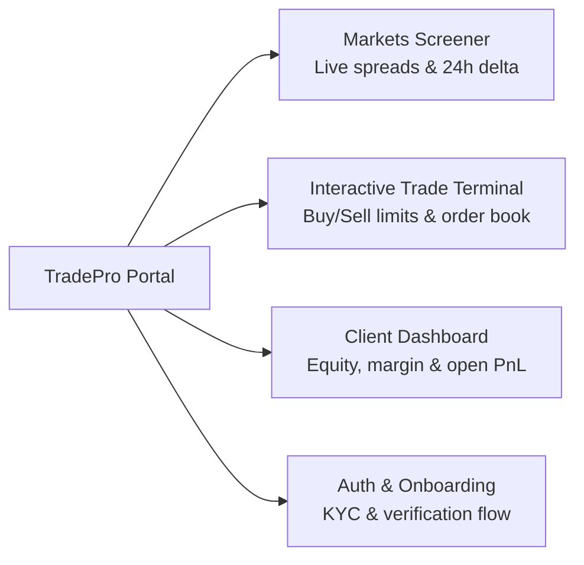

# 📈 TradePro — Multi-Asset Online Trading Platform

[](https://developer.mozilla.org/en-US/docs/Glossary/HTML5)
[](https://developer.mozilla.org/en-US/docs/Web/CSS)
[](https://developer.mozilla.org/en-US/docs/Web/JavaScript)
[]()

A high-performance **Multi-Asset Broker & Trading Platform** engineered for Forex, Equities, Crypto, Commodities, and Index CFD execution. Features an interactive trading terminal with live order-book depth, account overview dashboard, market screener, interactive charts, and seamless theme switching.

---

## 🏛️ Platform Architecture & Views



---

## 🌟 Key Features

* **Interactive Trading Terminal (`trade.html`):** Real-time price chart, market/limit order execution panel, leverage selector, take-profit / stop-loss calculators, and live position manager.
* **Trader Command Center (`dashboard.html`):** Real-time equity balance, free margin calculation, margin level ratio, open positions table, and deposit/withdrawal workflows.
* **Global Market Screener (`markets.html`):** Categorized asset filtering across Majors/Minors (EUR/USD, GBP/USD), Cryptocurrencies (BTC, ETH, SOL), Indices (S&P 500, NASDAQ, FTSE), and Commodities (Gold, Brent).
* **System-Aware Theme Engine:** Zero-FOUC Dark/Light mode switcher with localStorage persistence.
* **Complete Legal & Compliance Suite:** Dedicated terms, risk disclosures, privacy policies, and 404 pages.

---

## 🛠️ Quick Start

```bash
# Clone repository
git clone https://github.com/Kosis0/tradepro-trading-platform.git
cd tradepro-trading-platform

# Open index.html in any modern browser or run with npx serve:
npx serve .
```

---

## 🧑‍💻 Author
**Kosi Udeh (Udeh Kosisochukwu Emmanuel)**  
*Full-Stack Developer & Systems Architect*  
* **Portfolio:** [portfolio-lac-seven-pykd0ipign.vercel.app](https://portfolio-lac-seven-pykd0ipign.vercel.app)  
* **GitHub:** [@Kosis0](https://github.com/Kosis0)  
* **Contact:** [kosiudeh627@gmail.com](mailto:kosiudeh627@gmail.com) | [+234 911 795 0895](https://wa.me/2349117950895)
